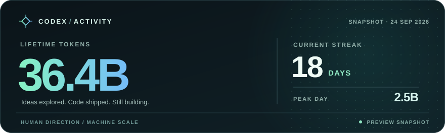

	<h1>James Tsetsekas</h1>
	<h3>Web & Digital Experience Developer · Product Engineer</h3>
	

		14+ years building web applications, digital experiences, payment systems, and developer tooling.
	

	

		
		
		
		
		
	

	

## Current Roles

| Organization | Role | Focus |
| --- | --- | --- |
| [Great Plains Communications](https://gpcom.com/) / [Rightfiber](https://www.rightfiber.com/) | Web & Digital Experience Developer | Building React applications and customer-facing journeys for the Rightfiber web experience. |
| [Conduit](https://conduit.market/) | Product Engineer | Building marketplace and merchant experiences for open-source commerce on Nostr with Bitcoin and Lightning. |

## Earlier Product Work

| Product | Contribution |
| --- | --- |
| Satmo | Built Lightning payment integrations for WooCommerce, Wix, and Shopify, including merchant checkout flows and Phoenixd-backed payment services. |
| OLM Foods / RightBytes | Led development of food-ordering experiences for customers and stores, including kiosks, digital signage, payment and delivery integrations; also built B2B ordering tools with WooCommerce. |

## What I Build

| Focus | What I ship |
| --- | --- |
| Bitcoin & Lightning | Self-custodial payment plugins, Lightning APIs, node tooling, merchant checkout flows, and LNbits/LND/Phoenixd integrations. |
| Nostr & Product Engineering | Marketplace and merchant workflows, NIP-07 signer integrations, encrypted messaging, privacy-focused checkout, and protocol interoperability. |
| Web & Digital Experience | Customer-facing React applications, responsive interfaces, content-driven pages, accessibility, and performance. |
| AI & Automation | LLM workflows for code generation, architecture review, research, monitoring, and internal operations. |
| Fintech & Markets | Digital securities settlement models, Bitcoin on-chain analytics, market-cycle charts, and financial data tools. |

## Selected Work

| Project | Why it matters | Stack |
| --- | --- | --- |
| [Conduit](https://conduit.market/) ([GitHub](https://github.com/Conduit-BTC)) | Open-source peer-to-peer commerce where products, orders, identity, and payments use Nostr and Bitcoin Lightning without platform custody of funds or user data. | TypeScript, React, Nostr, Bitcoin Lightning |
| [Codex Reset Guard](https://github.com/JamesTsetsekas/CodexResetGuard) ([Download](https://github.com/JamesTsetsekas/CodexResetGuard/releases/latest)) | Opt-in Windows tray app that redeems selected, existing banked Codex resets at a chosen usage threshold, with earliest-expiry selection, a reset allowance, and persistent recovery. | C#, WinForms, .NET Framework |
| [nos2x Auto Approver](https://github.com/JamesTsetsekas/nos2x-auto-approver) | Chromium signer fork for repeatable Nostr development and QA, with explicit host allowlists for unattended NIP-07 flows and standard prompts everywhere else. | JavaScript, Chrome Extensions, NIP-07 |
| [Jersey City Bitcoin](https://github.com/Jersey-City-Bitcoin/JerseyCityBitcoin) | Community site for the Jersey City Bitcoin Meetup and Socratic Seminar. | Bitcoin |
| [Fintech Analytics Suite](https://github.com/JamesTsetsekas/Fintech) | Bitcoin on-chain and market-cycle analytics, including Power Law, Pi Cycle, Rainbow, halving analysis, and ML-based price tools. | Python, matplotlib, pandas |
| [Digital Securities Settlement](https://github.com/JamesTsetsekas/digital-securities-settlement) | Atomic DvP settlement engine for tokenized securities with KYC, compliance, role-based controls, and CCP-gated workflows. | Solidity, Hardhat, OpenZeppelin, ethers.js |
| [Bond Settlement on DAML](https://github.com/JamesTsetsekas/bond-settlement-daml) | Multi-party bond issuance, trade matching, and atomic settlement modeled around clearing and custody workflows. | DAML, Canton |
| [LNbits Wallet Manager Skill](https://github.com/JamesTsetsekas/openclaw-skill-lnbits) | Agent skill for LNbits balance, invoice, payment, and QR-code workflows with explicit confirmation and credential-safety rules. | Python, LNbits, Lightning |
| [Self-hosted Bitcoin & Lightning stack](https://blog.jamestsetsekas.com/posts/rotate-lnd-macaroons-on-umbrel-after-btcpay-security-update/) | Run BTCPay Server, LND, and LNbits; document credential rotation, TLS recovery, and Bitcoin node maintenance. | BTCPay Server, LND, LNbits, Umbrel |

## Tech Stack

  

    <strong>LANGUAGES</strong> 
    
    
    
    
    
    
      
    
    
    
    
    
    
  

  

    <strong>FRAMEWORKS & PLATFORMS</strong> 
    
    
    
    
    
      
    
    
    
    
    
  

  

    <strong>DATA & INFRASTRUCTURE</strong> 
    
    
    
    
      
    
    
    
      
    
    
    
  

  

    <strong>CLOUD</strong> 
    
    
    
    
  

  

    <strong>PROTOCOLS & PAYMENTS</strong> 
    
    
    
    
      
    
    
    
  

  

    <strong>AI TOOLS</strong> 
    
    
    
    
  

## Zap me some sats

  
If my work helped you, send a few sats over Lightning.

  
  
Lightning address: <code>james@btc.jamestsetsekas.com</code>

